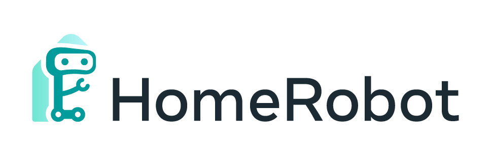

[](https://github.com/facebookresearch/home-robot/blob/main/LICENSE)
[](https://www.python.org/downloads/release/python-370/)
[](https://dl.circleci.com/status-badge/redirect/gh/facebookresearch/home-robot/tree/main)
[](https://github.com/pre-commit/pre-commit)
[](https://github.com/psf/black)
[](https://timothycrosley.github.io/isort/)

Your open-source robotic mobile manipulation stack!

HomeRobot lets you get started running a range of robotics tasks on a low-cost mobile manipulator, starting with _Open Vocabulary Mobile Manipulation_, or [OVMM](https://ovmm.github.io/). OVMM is a challenging task which means that, in an unknown environment, a robot must:
  - Explore its environment
  - Find an object
  - Find a receptacle -- a location on which it must place this object
  - Put the object down on the receptacle.

Check out the [Neurips 2023 HomeRobot Open-Vocabulary Mobile Manipulation Challenge!](https://aihabitat.org/challenge/2023_homerobot_ovmm/)

When you're ready, 
follow [these instructions to participate](https://github.com/facebookresearch/home-robot/blob/home-robot-ovmm-challenge-2023-v0.1.2/docs/challenge.md).

**Important note for new OVMM challenge participants:** If you are participating in the challenge and starting now, please use the home-robot release `home-robot-ovmm-challenge-2023-v0.1.2`. You can start out by cloning home-robot via:
```
git clone https://github.com/facebookresearch/home-robot --branch home-robot-ovmm-challenge-2023-v0.1.2
```

## Core Concepts

This package assumes you have a low-cost mobile robot with limited compute -- initially a [Hello Robot Stretch](https://hello-robot.com/stretch-2) -- and a "workstation" with more GPU compute. Both are assumed to be running on the same network.

This is the recommended workflow for hardware robots:
  - Turn on your robot; for the Stretch, run `stretch_robot_home.py` to get it ready to use.
  - From your workstation, SSH into the robot and start a [ROS launch file](http://wiki.ros.org/roslaunch) which brings up necessary low-level control and hardware drivers.
  - If desired, run [rviz](http://wiki.ros.org/rviz) on the workstation to see what the robot is seeing.
  - Start running your AI code on the workstation - For example, you can run `python projects/real_world_ovmm/eval_episode.py` to run the OVMM task.

We provide a couple connections for useful perception libraries like [Detic](https://github.com/facebookresearch/Detic), [Grounded-SAM](https://github.com/IDEA-Research/Grounded-Segment-Anything) and [Contact Graspnet](https://github.com/NVlabs/contact_graspnet), which you can then use as a part of your methods.

## Installation

### Preliminary

HomeRobot requires Python 3.9. Installation on a workstation requires [conda](https://docs.conda.io/projects/conda/en/latest/user-guide/install/linux.html) and [mamba](https://mamba.readthedocs.io/en/latest/user_guide/mamba.html). Installation on a robot assumes Ubuntu 20.04 and [ROS Noetic](http://wiki.ros.org/noetic).

To set up the hardware stack on a Hello Robot  Stretch, see the [ROS installation instructions](docs/install_robot.md) in `home_robot_hw`.

You may need a calibrated URDF for our inverse kinematics code to work well; see [calibration notes](docs/calibration.md).

[Spot installation instructions](docs/spot.md) are experimental but are also available.

#### Network Setup

Follow the [network setup guide](docs/network.md) to set up your robot to use the network, and make sure that it can communicate between workstation and robot via ROS. On the robot side, start up the controllers with:
```
roslaunch home_robot_hw startup_stretch_hector_slam.launch
```

### Workstation Instructions

To set up your workstation, follow these instructions. HomeRobot requires Python 3.9. These instructions assume that your system supports CUDA 11.7 or better for pytorch; earlier versions should be fine, but may require some changes to the conda environment.

If on Ubuntu, ensure some basic packages are installed:
```
sudo apt update
sudo apt install build-essential zip unzip
```

Then clone home-robot locally:
```
git clone https://github.com/facebookresearch/home-robot.git
cd ./home-robot
```

#### 1. Create Your Environment

If necessary, [install mamba](https://mamba.readthedocs.io/en/latest/installation.html) in your base conda environment. Optionally: [install ROS noetic](http://wiki.ros.org/noetic/Installation/Ubuntu) on your workstation.

```
# If using ROS - make sure you don't have PYTHONPATH set
unset PYTHONPATH

# Otherwise, use the version in src/home_robot
mamba env create -n home-robot -f src/home_robot/environment.yml

# Activate the environment
conda activate home-robot

# Optionally, update this environment to install ROS
mamba env update -f src/home_robot_hw/environment.yml
```

These should install pytorch; if you run into trouble, you may need to edit the installation to make sure you have the right CUDA version. See the [pytorch install notes](docs/install_pytorch.md) for more.

Optionally, setup a [catkin workspace](docs/catkin.md) to use improved ROS visualizations.

#### 2. Run Install Script

Make sure you have the correct environment variables set: `CUDA_HOME` should point to your cuda install, matching the one used by your python environment. We recommend 11.7, and it's what will be automatically installed above as a part of the conda environment.

To build some third-party dependencies, you also need the full cuda toolkit with its compiler, `nvcc`. You can download it from [nvidia's downloads page](https://developer.nvidia.com/cuda-11-7-0-download-archive?target_os=Linux&target_arch=x86_64&Distribution=Ubuntu). Download the runfile, and make sure to check the box NOT to install your drivers or update your system cuda version. It will be installed at a separate location.

Then make sure the environment variables are set to something reasonable, for example:
```
export HOME_ROBOT_ROOT=$USER/home-robot
export CUDA_HOME=/usr/local/cuda-11.7
```

Finally, you can run the [install script](install_deps.sh) to download submodules, model checkpoints, and build Detic for open-vocabulary object detection:
```
conda activate home-robot
cd $HOME_ROBOT_ROOT
./install_deps.sh
```

If you run into issues, check out the [step-by-step instructions](docs/install_workstation.md).

*As of 2023-10-31,* you may see some issues with the version of [ros-numpy](git@github.com:cpaxton/ros_numpy.git) installed via pip; try installing it directly from source.


#### 3. Simulation Setup

To set up the simulation stack with Habitat, train DDPPO skills and run evaluations: see the [installation instructions](src/home_robot_sim/README.md) in `home_robot_sim`. As with other components, the simulation assumes that you have Python 3.9, conda, mamba, and CUDA 11.7 or greater, although other CUDA versions may work.

For more details on the OVMM challenge, see the [Habitat OVMM readme](projects/habitat_ovmm/README.md). You can start by running the [install script](projects/habitat_ovmm/install.sh) to download all the necessary data:

```
$HOME_ROBOT_ROOT/projects/habitat_ovmm/install.sh
```


#### 4. Run Open Vocabulary Mobile Manipulation on Stretch

You should then be able to run the Stretch OVMM example.

Run a grasping server; either Contact Graspnet or our simple grasp server. We recommend starting with our grasp server:
```
# For simple grasping server
cd $HOME_ROBOT_ROOT
conda activate home-robot
python src/home_robot_hw/home_robot_hw/nodes/simple_grasp_server.py

# For contact graspnet
cd $HOME_ROBOT_ROOT/src/third_party/contact_graspnet
conda activate contact_graspnet_env
python contact_graspnet/graspnet_ros_server.py  --local_regions --filter_grasps
```

Then you can run the OVMM example script:
```
cd $HOME_ROBOT_ROOT
python projects/real_world_ovmm/eval_episode.py
```

## Code Contribution

We welcome contributions to HomeRobot.

There are two main classes in HomeRobot that you need to be concerned with:
  - *Environments* extend the [abstract Environment class](https://github.com/facebookresearch/home-robot/blob/main/src/home_robot/home_robot/core/abstract_env.py) and provide *observations* of the world, and a way to *apply actions*.
  - *Agents* extend the [abstract Agent class](https://github.com/facebookresearch/home-robot/blob/main/src/home_robot/home_robot/core/abstract_agent.py), which takes in an [observation](https://github.com/facebookresearch/home-robot/blob/main/src/home_robot/home_robot/core/interfaces.py#L95) and produces an [action](https://github.com/facebookresearch/home-robot/blob/main/src/home_robot/home_robot/core/interfaces.py#L50).

Generally, new methods will be implemented as Agents.


### Developing on Hardware

See the robot [hardware development guide](docs/hardware_development.md) for some advice that may make developing code on the Stretch easier.

### Organization

[HomeRobot](https://github.com/facebookresearch/home-robot/) is broken up into multiple different packages:

| Resource | Description |
| -------- | ----------- |
| [home_robot](src/home_robot) | Core package containing agents and interfaces |
| [home_robot_sim](src/home_robot_sim) | OVMM simulation environment based on [AI Habitat](https://aihabitat.org/) |
| [home_robot_hw](src/home_robot_hw) | ROS package containing hardware interfaces for the Hello Robot Stretch |
| [home_robot_spot](src/home_robot_spot) | Minimal package for using the Boston Dynamics Spot |

The [home_robot](src/home_robot) package contains embodiment-agnostic agent code, such as our [ObjectNav agent](https://github.com/facebookresearch/home-robot/blob/main/src/home_robot/home_robot/agent/objectnav_agent/objectnav_agent.py) (finds objects in scenes) and our [hierarchical OVMM agent](https://github.com/facebookresearch/home-robot/blob/main/src/home_robot/home_robot/agent/ovmm_agent/ovmm_agent.py). These agents can be extended or modified to implement your own solution.

Importantly, agents use a fixed set of [interfaces](https://github.com/facebookresearch/home-robot/blob/main/src/home_robot/home_robot/core/interfaces.py) which are overridden to provide access to 

The [home_robot_sim](src/home_robot_sim) package contains code for interface

### Style

We use linters for enforcing good code style. The `lint` test will not pass if your code does not conform.

Install the git [pre-commit](https://pre-commit.com/) hooks by running
```bash
python -m pip install pre-commit
cd $HOME_ROBOT_ROOT
pre-commit install
```

To format manually, run: `pre-commit run --show-diff-on-failure --all-files`


## License
Home Robot is MIT licensed. See the [LICENSE](./LICENSE) for details.
