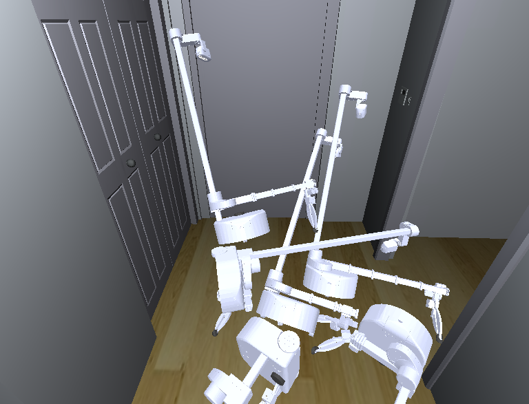
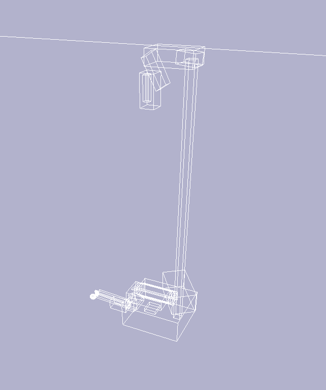

## Stretch Model for Habitat

Want a lot of robots?



Above: graphic showing the Stretch placed many times in habitat2.



This repo was modified to make it easier to use for large scale data collection in Habitat2.

## Old Overview

*stretch_description* provides materials for a [URDF](http://wiki.ros.org/urdf) kinematic model of the Stretch RE1 mobile manipulator from Hello Robot Inc.

This repo is based on [this fork of stretch ros](https://github.com/cpaxton/stretch_ros/tree/feature/dex-wrist).

## Details

The *meshes directory* contains [STL mesh files](https://en.wikipedia.org/wiki/STL_(file_format)) representing the exterior geometry of various parts of the robot. 

The *urdf directory* contains [xacro files](http://wiki.ros.org/xacro) representing various parts of the robot that are used to generate the robot's URDF. 

stretch_ros expects a URDF with the name stretch.urdf to reside within the urdf directory. The file stretch.urdf serves as the URDF for the robot and must be generated. Typically, it is a calibrated urdf file for the particular Stretch RE1 robot being used. To generate this file, please read the documentation within stretch_ros/stretch_calibration. 

The xacro_to_urdf.sh will usually only be indirectly run as part of various scripts and launch files within stretch_ros/stretch_calibration. 

Sometimes a stretch_uncalibrated.urdf file will reside with the urdf directory. This file is typically generated directly from the xacro files without any alterations. 

## Exporting a URDF

Sometimes a URDF is useful outside of ROS, such as for simulations and analysis. Running the *export_urdf.sh* script in the urdf directory will export a full URDF model of the robot based on stretch.urdf. 

The exported URDF will be found within an exported_urdf directory. It is also copied to a directory for your specific robot found under ~/stretch_user. The exported URDF includes meshes and controller calibration YAML files. The exported URDF can be visualized using stretch_urdf_show.py, which is part of the stretch_body Python code. 

## Changing the Tool

If you wish to remove the default gripper and add a different tool, you will typically edit /stretch_description/urdf/stretch_description.xacro. Specifically, you will replace the following line in order to include the xacro for the new tool and then follow directions within stretch_ros/stretch_calibration to generate a new calibrated urdf file (stretch.urdf) that includes the new tool.

`<xacro:include filename="stretch_gripper.xacro" />`

As an example we provide the xacro `stretch_dry_erase_marker.xacro` and its dependent mesh files with stretch_ros. 

Some of the tools found in the [Stretch Body Tool Share](https://github.com/hello-robot/stretch_tool_share/) include URDF data. To integrate these tools into the URDF for your Stretch

```bash
>>$ cd ~/repos
>>$ git clone https://github.com/hello-robot/stretch_tool_share
>>$ cd stretch_tool_share/<tool name>
>>$ cp stretch_description/urdf/* ~/catkin_ws/src/stretch_ros/stretch_description/urdf/
>>$ cp stretch_description/meshes/* ~/catkin_ws/src/stretch_ros/stretch_description/meshes/
```

Next add the xacro for the particular tool to `/stretch_description/urdf/stretch_description.xacro`. Then you can generate and preview the uncalibrated URDF:

```bash
>>$ cd ~/catkin_ws/src/stretch_ros/stretch_description/urdf
>>$ cp stretch.urdf stretch.urdf.bak
>>$ rosrun stretch_calibration update_urdf_after_xacro_change.sh
```

Now visualize the new tool

```bash
>>$ roslaunch stretch_calibration simple_test_head_calibration.launch
```


## License and Patents

Patents are pending that cover aspects of the Stretch RE1 mobile manipulator.

For license information, please see the LICENSE files. 
