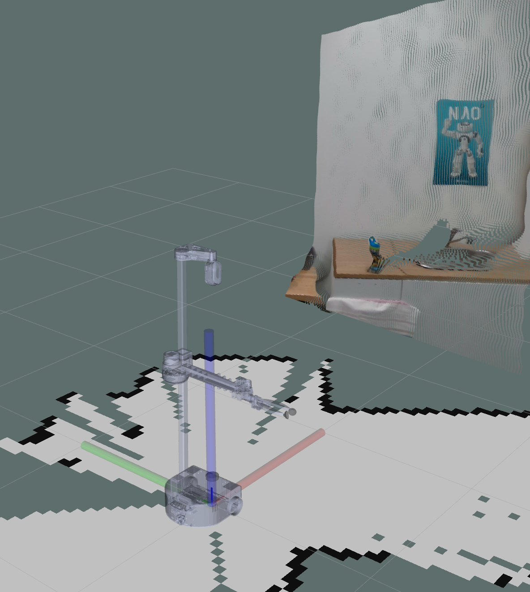

# Workstation ROS Setup

It may be useful to create a local ROS workspace in addition to using the one on the robot. The biggest advantage here is being able to use complete robot meshes in RVIZ that match your robot remotely.

```
# Create a catkin workspace
cd $HOME
mkdir catkin_ws
cd catkin_ws
catkin_init_workspace

# Link your home robot package to it
ln -s $HOME_ROBOT_ROOT/src/home_robot_hw $HOME/catkin_ws/src/home_robot_hw

# Clone the stretch_ros code
cd src
git clone git@github.com:hello-robot/stretch_ros.git
```

Stretch requires `move_base` to be installed:
```
sudo apt install ros-noetic-move-base
```

Now you should be able to build ROS:
```
cd $HOME/catkin_ws
source /opt/ros/noetic/setup.bash
catkin_make -DPYTHON_EXECUTABLE=`which python3`
```

This should build you a custom catkin environment built on top of the `home-robot` environment that we already created.

## Testing

On the robot start up the drivers:
```
roslaunch home_robot_hw startup_stretch_hector_slam.launch
```

Then on your desktop run the following:
```
source $HOME/catkin_ws/devel/setup.bash
roslaunch home_robot_hw visualization.launch
```



You should see RVIZ come up, now with a mesh showing your current robot state.

## Usage

If you will be running ROS commands frequently, add this to your `~/.bashrc` file:
```
source $HOME/catkin_ws/devel/setup.bash
```

There is an equivalent for the `zsh` shell; check the ROS documentation for more.
