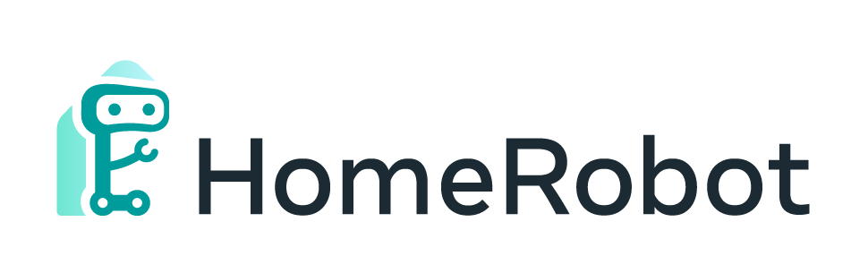

## 🏠🤖 Challenge  🚀
The objective of the HomeRobot: OVMM Challenge is to create a platform that enables researchers to develop agents that can navigate unfamiliar environments, manipulate novel objects, and move away from closed object classes towards open-vocabulary natural language. This challenge aims to facilitate cross-cutting research in embodied AI using recent advances in machine learning, computer vision, natural language, and robotics.

Check out the [Neurips 2023 HomeRobot Open-Vocabulary Mobile Manipulation Challenge!](https://aihabitat.org/challenge/2023_homerobot_ovmm/)

### Participation Guidelines

Participate in the contest by registering on the [EvalAI challenge page](https://eval.ai/web/challenges/challenge-page/2100) and creating a team. Participants will upload docker containers with their agents that are evaluated on an AWS GPU-enabled instance. Before pushing the submissions for remote evaluation, participants should test the submission docker locally to ensure it is working. Instructions for training, local evaluation, and online submission are provided below.

#### Prerequisites 
Make sure you have [Docker](https://docs.docker.com/engine/install/ubuntu/) with [NVIDIA Container Toolkit](https://docs.nvidia.com/datacenter/cloud-native/container-toolkit/latest/install-guide.html) installed. Also, set up [Docker for a non-root user](https://docs.docker.com/engine/install/linux-postinstall/#manage-docker-as-a-non-root-user).

#### Local Evaluation

1. Clone the challenge repository
   ```
   git clone https://github.com/facebookresearch/home-robot.git --branch home-robot-ovmm-challenge-2023-v0.1.2
   ```
1. Navigate to `projects/habitat_ovmm`
   ```
   cd projects/habitat_ovmm
   ```
1. Implement your own agent or try our baseline agent, located in [projects/habitat_ovmm/eval_baselines_agent.py](../projects/habitat_ovmm/eval_baselines_agent.py).
1. Modify the provided [projects/habitat_ovmm/docker/ovmm_baseline.Dockerfile](../projects/habitat_ovmm/docker/ovmm_baseline.Dockerfile) if you need custom modifications. Let’s say your code needs `<some extra package>`, this dependency should be pip installed inside a conda environment called `home-robot` that is shipped with our HomeRobot challenge docker, as shown below:
    ```dockerfile
    FROM fairembodied/habitat-challenge:homerobot-ovmm-challenge-2023

    # install dependencies in the home-robot conda environment
    RUN /bin/bash -c "\
        . activate home-robot \
        && pip install <some extra package> \
        "

    # add your agent code
    ADD your_agent.py /home-robot/projects/habitat_ovmm/agent.py

    # add submission script
    ADD scripts/submission.sh /home-robot/submission.sh

    # set evaluation type to remote
    ENV AGENT_EVALUATION_TYPE remote

    # run submission script
    CMD /bin/bash -c "\
        . activate home-robot \
        && cd /home-robot \
        && export PYTHONPATH=/evalai_remote_evaluation:$PYTHONPATH \
        && bash submission.sh \
        "
    ```
    *Note:* we provide 2 versions of the base Docker image participants may build from:
    - `fairembodied/habitat-challenge:homerobot-ovmm-challenge-2023-ubuntu22.04` (alias of `fairembodied/habitat-challenge:homerobot-ovmm-challenge-2023`)
    - `fairembodied/habitat-challenge:homerobot-ovmm-challenge-2023-ubuntu20.04`
    - `fairembodied/habitat-challenge:homerobot-ovmm-challenge-2023-cpu` (a ubuntu 22.04 cpu-only version; you will not need GPUs when using this)

    These differ in Ubuntu version and the choice between CPU or GPU for running torch code. Our example baseline Docker image uses `fairembodied/habitat-challenge:homerobot-ovmm-challenge-2023` as a base image. But participants may use any of the base Docker images listed above.

1. Build your Docker image using:

    ```bash
    docker build . \
        -f docker/ovmm_baseline.Dockerfile \
        -t ovmm_baseline_submission
        --network host
    ```
    *Note 1:* Please, make sure that you keep your local version of `fairembodied/habitat-challenge:homerobot-ovmm-challenge-2023` image up to date with the image we have hosted on [dockerhub](https://hub.docker.com/r/fairembodied/habitat-challenge/tags). This can be done by pruning all cached images, using:
    ```
    docker system prune -a
    ```
    *Note 2:* You can modify `submission.sh` file if your agent needs any custom modifications (e.g. command-line arguments). For example, agent type may be changed by changing `--agent_type` (and corresponding `--baseline_config_path`) argument in the `./scripts/test_local.sh` or `projects/habitat_ovmm/eval_baselines_agent.py`. Otherwise, nothing to do. Default submission.sh is simply a call to agent in `agent.py`

   For evaluating an agent taking random actions, build a Docker image using [projects/habitat_ovmm/docker/ovmm_random_agent.Dockerfile](../projects/habitat_ovmm/docker/ovmm_random_agent.Dockerfile) as follows:

    ```bash
    docker build . \
        -f docker/ovmm_random_agent.Dockerfile \
        -t ovmm_random_agent_submission
        --network host
    ```

1. Download all the required data into the `home-robot/data` directory (see [Habitat OVMM readme](../projects/habitat_ovmm/README.md)). Then in your `docker run` command mount `home-robot/data` data folder to the `home-robot/data` folder in the Docker image (see `./scripts/test_local.sh` for reference).
     
1. Evaluate your docker container locally:
    ```bash
    ./scripts/test_local.sh --docker-name ovmm_baseline_submission --split minival
    ```
    Similarly, the random agent can be evaluated locally with:

    ```bash
    ./scripts/test_local.sh --docker-name ovmm_random_agent_submission --split minival
    ```

    If the above command runs successfully (for the random agent) you will get an output similar to:
    ```
    2023-07-18 21:02:10,607 Initializing dataset OVMMDataset-v0
    2023-07-18 21:02:10,713 initializing sim OVMMSim-v0
    21:02:13,991 Initializing task OVMMNavToObjTask-v0
    100%|██████████| 10/10 [00:36<00:00,  3.64s/it]
    ==================================================
    Averaged metrics
    ==================================================
    episode_count: 10.0
    does_want_terminate: 1.0
    num_steps: 84.8
    find_object_phase_success: 0.0
    pick_object_phase_success: 0.0
    find_recep_phase_success: 0.0
    overall_success: 0.0
    partial_success: 0.0
    ==================================================
    Metrics:
    {'episode_count': 10.0, 'does_want_terminate': 1.0, 'num_steps': 84.8, 'find_object_phase_success': 0.0, 'pick_object_phase_success': 0.0, 'find_recep_phase_success': 0.0, 'overall_success': 0.0, 'partial_success': 0.0}
    ```
    Note: this same command will be run to evaluate your agent for the leaderboard. **Please submit your docker for remote evaluation (below) only if it runs successfully on your local setup.** 

#### Online Submission

Follow instructions in the `submit` tab of the EvalAI challenge page to submit your docker image. Note that you will need a version of EvalAI `>= 1.3.5`. Pasting those instructions here for convenience:

1. Installing EvalAI Command Line Interface
    ```bash
    pip install "evalai>=1.3.5"
    ```

2. Set EvalAI account token
    ```bash
    evalai set_token <your EvalAI participant token>
    ```

3. Push docker image to EvalAI docker registry. See below for more detailed example commands.
    ```bash
    evalai push ovmm_baseline_submission --phase <phase-name>
    ```

4. Use `--private` or `--public` flag in the submission command to make the submission private or public respectively.

5. For more commands, please refer to [evalai-cli documentation](https://cli.eval.ai/).


The challenge consists of the following phases:

1. **Minival phase**: The purpose of this phase is sanity checking — to confirm that remote evaluation reports the same result as local evaluation. Each team is allowed up to 100 submissions per day. We will disqualify teams that spam the servers.
1. **Test standard phase**: The purpose of this phase/split is to serve as the public leaderboard establishing the state of the art. This is what should be used to report results in papers. Each team is allowed up to 10 submissions per day, to be used judiciously.
1. **Test challenge phase**: This split will be used to decide challenge teams who will proceed to Stage 2 Evaluation. Each team is allowed a total of 5 submissions until the end of challenge submission phase. The highest performing of these 5 will be automatically chosen.

Simulation agents will be evaluated on an AWS EC2 p2.xlarge instance which has a Tesla K80 GPU (12 GB Memory), 4 CPU cores, and 61 GB RAM. Agents will be evaluated on 1000 episodes and will have a total available time of 48 hours to finish each run. If you need more time/resources for evaluation of your submission please get in touch. If you face any issues or have questions you can ask them by opening an issue on this repository.

### Example Commands

```
# For minival submissions
# With a public submission, anyone can see your score
evalai push <image>:<tag> --phase neurips-ovmm-minival-2023-2100
# You can also make a private submission - no one but you and the organizers can see the results
evalai push <image>:<tag> --phase neurips-ovmm-minival-2023-2100 --private

# For standard test submissions
# With a public submission, anyone can see your score
evalai push <image>:<tag> --phase neurips-ovmm-test-standard-2023-2100
# Make a private submission - no one but you and the organizers can see the result
evalai push <image>:<tag> --phase neurips-ovmm-test-standard-2023-2100 --private

# For challenge submissions - YOU ONLY HAVE 5 SUMBMISSIONS EVER!
# BE VERY CAREFUL ATTEMPTING THIS! Again, you only get five (5) attempts for the whole challenge
evalai push <image>:<tag> --phase neurips-ovmm-test-challenge-2023-2100
# Alternately, make a private submission 
evalai push <image>:<tag> --phase neurips-ovmm-test-challenge-2023-2100 --private
```

### DD-PPO Training Starter Code
Please refer to the Training DD-PPO skills section of the [Habitat OVMM readme](../projects/habitat_ovmm/README.md#training-dd-ppo-skills) for more details.


