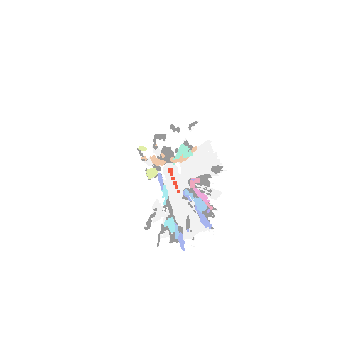

### Purpose

This example shows you how to build a semantic map offline from previously collected trajectories.

### Usage
Given a sequence of `home_robot.core.interfaces.Observations` saved as pickle files in `trajectories/airbnb1` as `obs1.pkl`, `obs2.pkl`, etc., build the map with
```
python projects/offline_mapping/build_map.py \
    --input_trajectory_path trajectories/airbnb1 \
    --output_visualization_path map_visualization/airbnb1.png
```
You can see a visualization at `map_visualization/airbnb1.png`.

It should look something like this:

