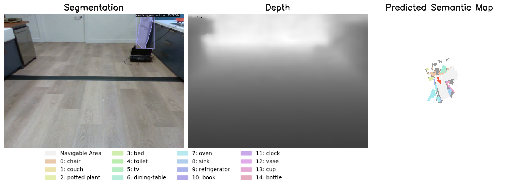

### Purpose

This example shows you how to build a semantic map offline from previously collected trajectories.

### Usage
Given a sequence of `home_robot.core.interfaces.Observations` saved as pickle files in `trajectories/airbnb1` as `obs1.pkl`, `obs2.pkl`, etc., build the map with
```
python projects/offline_mapping/build_map.py \
    --input_trajectory_dir trajectory/ \
    --output_visualization_dir map_visualization/
```
You can see timestep visualizations and a video in the `map_visualization` folder.

It should look something like this:

